# 🚀 Assignment 01: Static Website Deployment on AWS S3 via Terraform

This terraform code demonstrates how to deploy a static HTML website on AWS S3.
---

## 🌐 What Does It Do?

I've performed the following tasks:
- Created a globally unique **S3 bucket**
- Configured public access so the bucket can serve content to the web
- Set up a **static website hosting** for the bucket
- Uploaded an HTML file (`index.html`) to the bucket (contains basic code)
- Outputs a public **website URL**

---

## 🧰 Prerequisites

following should be configured:

- ✅ Configure your AWS CLI credentials (if not already done):
- ✅ An AWS account with permissions to manage S3


```bash
aws configure
```

## One Problem that I encountered
 - Adding credentials or configuring them, which I further tried to resolve by using sso,
which I resolved further by using AWS_ENV command (also tried hardcoding them into the shell directly).
This worked for me :
```bash
aws configure sso
```


 - Access Denied while trying to create bucket
 

```bash
export AWS_ACCESS_KEY_ID=your_access_key
export AWS_SECRET_ACCESS_KEY=your_secret_key
export AWS_DEFAULT_REGION=us-east-1
```

## 📁 Project Structure
assignment-01-s3-static-website/
- ├── index.html
- ├── main.tf
- ├── variables.tf
- ├── outputs.tf
- └── terraform.tfstate (after apply)


## 📄 File Descriptions
- index.html – The static web page to be served

- main.tf – All AWS resources (S3 bucket, policy, object, website config)

- variables.tf – Input variables like bucket_name and aws_region

- outputs.tf – Displays the S3 website endpoint

## 📸Screenshots
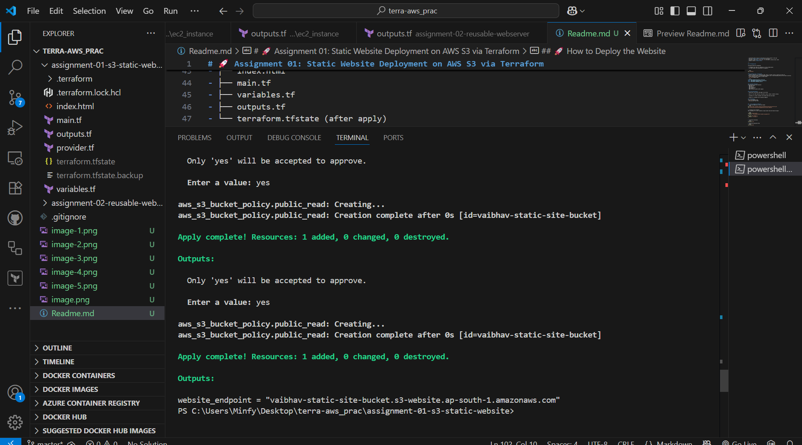
- Hosting would look like
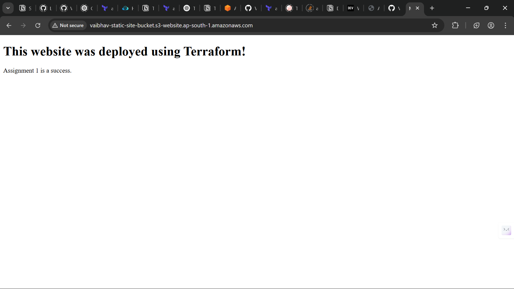


## 🚀 How to Deploy the Website
1. Clone the Repository or Use the Folder
```bash
git clone https://github.com/your-username/terraform-aws-practice.git
cd terraform-aws-practice/assignment-01-s3-static-website
```

2. Customize Your Variables
Edit variables.tf to set a globally unique bucket name and desired region:

```bash
variable "bucket_name" {
  default = "my-unique-bucket-vaibhav-assignment-01"
}
variable "aws_region" {
  default = "us-east-1"
}
```

3. Initialize Terraform
```bash
terraform init
```
4. Review the Execution Plan
```bash
terraform plan
```
5. Apply the Configuration
```bash
terraform apply
```
6. Get Your Website URL
After a successful apply, Terraform will output something like:
```bash
website_endpoint = "http://my-unique-bucket-vaibhav-assignment-01.s3-website-us-east-1.amazonaws.com"
```

7. Cleanup
```bash
terraform destroy
```

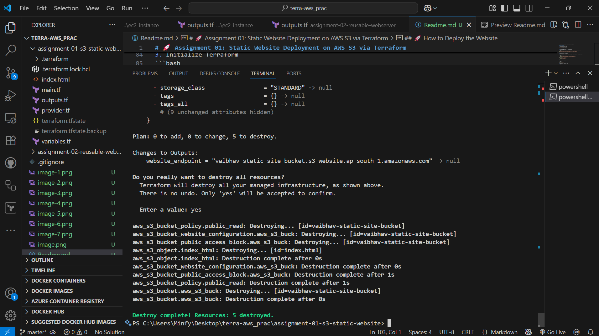
---
---

# 🧱 Assignment 02: Reusable EC2 Web Server Module with Terraform

Demonstrates how to build a **reusable Terraform module** for provisioning a web server on AWS. The assignment emphasizes **modular design**, **code reuse**, and clean infrastructure-as-code practices.

---

## 🎯 Objective

Refactor a hardcoded EC2 web server configuration into a reusable **Terraform module**. This helps make your infrastructure more scalable, maintainable, and portable.

---

## 📦 Project Structure

- assignment-02-reusable-webserver/
- ├── main.tf # Root: VPC, Subnet, SG, and Module Call
- ├── variables.tf # Root variables
- ├── outputs.tf # Root output (public IP)
- ├── modules/
- │ └── ec2_instance/
- │ ├── main.tf # EC2 instance definition
- │ ├── variables.tf # Module inputs
- │ └── outputs.tf # Module outputs

## 📄 What is Happening here
This Terraform setup:
- Provisions a **VPC**, **public subnet**, and **internet gateway**
- Sets up a **security group** allowing SSH and HTTP
- Defines a **reusable EC2 module** with flexible variables
- Deploys a web server EC2 instance using the module
- Outputs the instance's **public IP address**

---

## 🧰 Prerequisites

following should be configured:

- ✅ Configure your AWS CLI credentials (if not already done):
- ✅ An AWS account with permissions to manage S3

```bash
aws configure
```
then follow along,
or
```bash
export AWS_ACCESS_KEY_ID=your_access_key
export AWS_SECRET_ACCESS_KEY=your_secret_key
export AWS_DEFAULT_REGION=us-east-1
```

## 🚀 How to Deploy
1. Navigate to the assignment directory:
```bash
cd assignment-02-reusable-webserver
```

2. Update the variables.tf file as per your needs, for ex- I want to use "us-east-1" instead of "ap-south-1", so I will edit the value for that in variables.tf as per my need

3. Initialise, plan and apply
```bash
terraform init #initialises
terraform plan #checks
terraform apply #starts
```

## 📸Screenshots
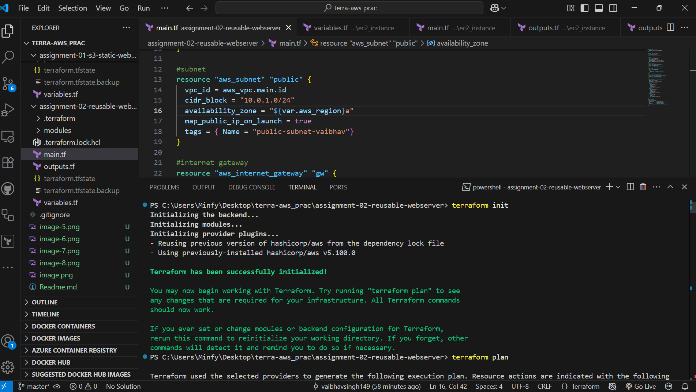

- terraform apply
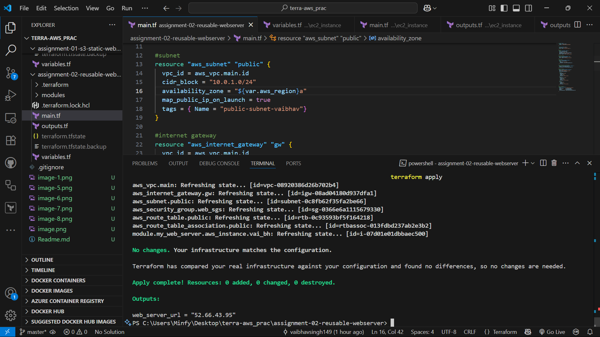

- hosting will look like
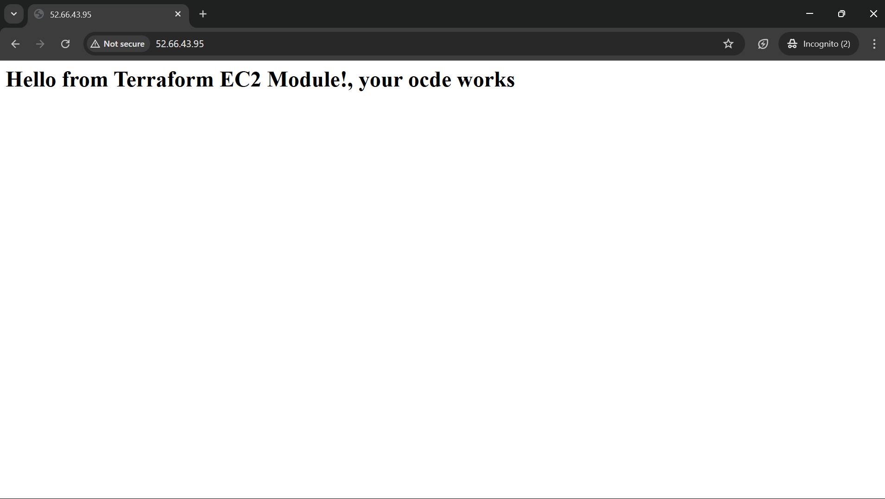

- Cleanup
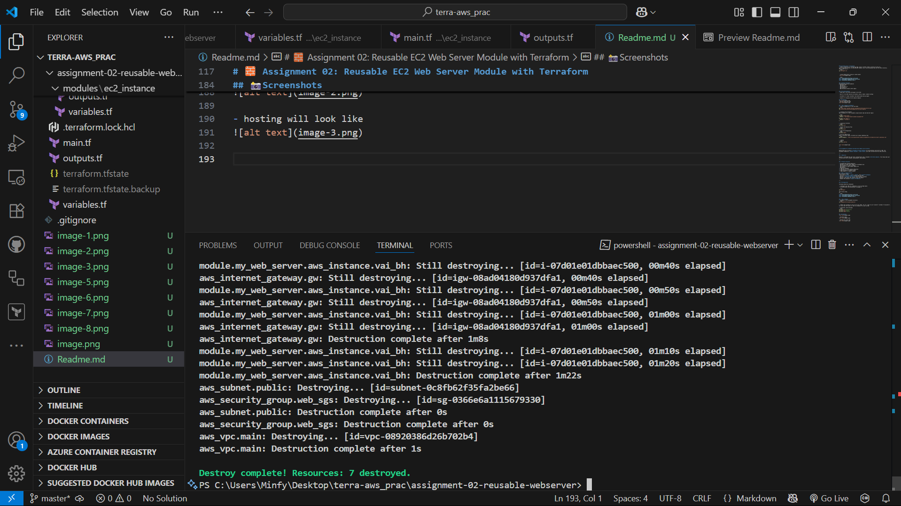

## Problems I encountered
- Access denied was a common issue I faced, which was resolved the same way I did before
- Accidentaly passed security group as a string instead of a list, later figured out sgs are passed as lists


---
---
Work that we did in class
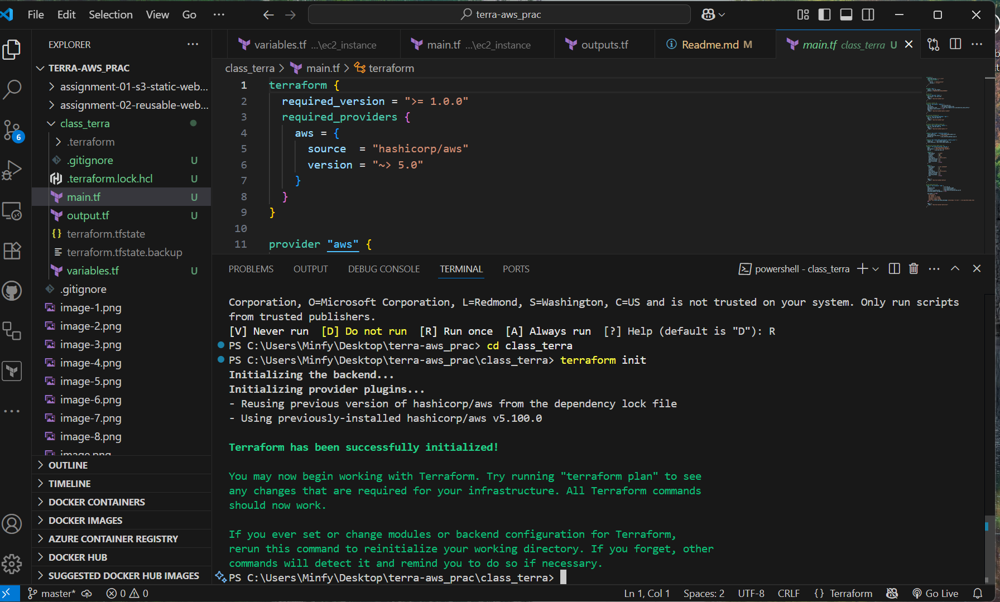

- checking if it is working 
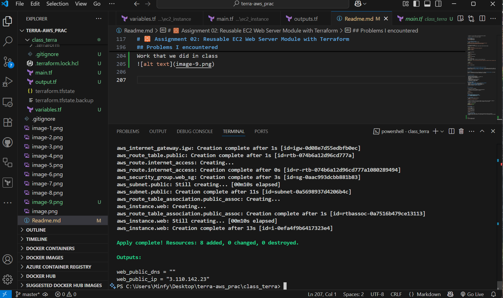

- it works, confirmation
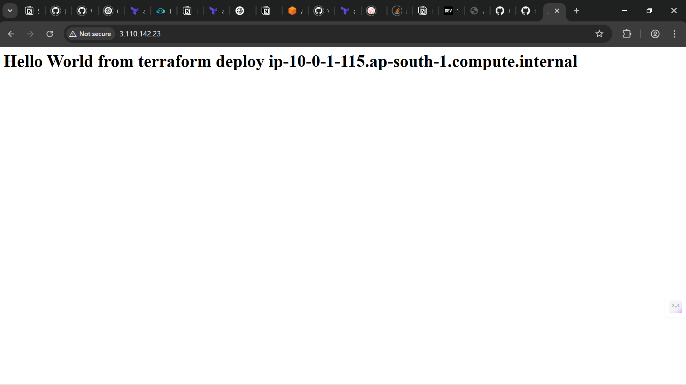

- cleanup
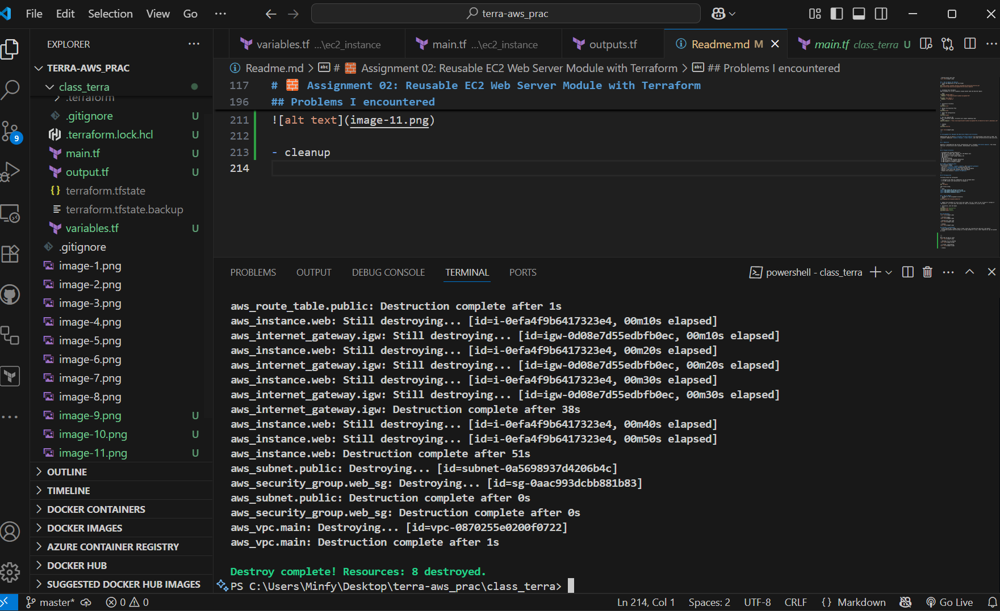

