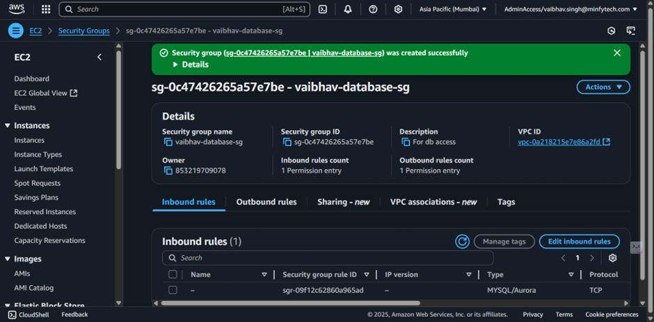

## AWS Web Server 
- Creating a set of key pairs for secure access

- configured subnets 

- internet gateway

- route tables

- updated routes 
 

- subnet assosciation

- Security groups

- accessing the website using public ip, as I allowed for enable public ip

- Cleanup

---
---
## Take home assignment-2,

# Step-by-Step Guide for Deploying a Basic Two-Tier Architecture on AWS
- Part 1: Building the Network Base
1. Create a Virtual Private Cloud (VPC):
VPC Name: two-tier-vpc
CIDR Block: 10.10.0.0/16
2. Set Up Subnets:
Public Subnet:
Name: public-subnet-1
CIDR: 10.10.1.0/24
Private Subnet:
Name: private-subnet-1
CIDR: 10.10.2.0/24
3. Internet Gateway Configuration:
Create an Internet Gateway and attach it to your VPC.
4. Route Table Setup:
Public Subnet Route Table:
Add a route for 0.0.0.0/0 pointing to the Internet Gateway.
Private Subnet Route Table:
Keep default settings (no direct route to the Internet).
Part 2: Configuring Security Groups
1. Web Application Security Group (webapp-sg):
Allow inbound HTTP (port 80) from anywhere (0.0.0.0/0).
Allow inbound SSH (port 22) only from your own IP address.
2. Database Security Group (database-sg):
Allow inbound MySQL (port 3306) traffic only from the webapp-sg security group.
Do not allow SSH or any public access.
Part 3: Launch EC2 Instances
1. Web Server Instance:
Instance Type: t2.micro
Name: Web-Server
Subnet: public-subnet-1
Public IP: Enable auto-assign
Security Group: webapp-sg
User Data: Use a script to install and start the web server
2. Database Server Instance:
Instance Type: t2.micro
Name: DB-Server
Subnet: private-subnet-1
Public IP: Disable auto-assign
Security Group: database-sg
Part 4: Verification and Testing
1. Test Web Server Accessibility:
Open a browser and navigate to the public IP address of the Web-Server.
You should see your web application running.
2. SSH into Web Server:
Connect via SSH using the Web-Server’s public IP to ensure secure shell access is working.
3. Test Database Connectivity:
From the Web-Server, use the command below to check connectivity to the database instance:

